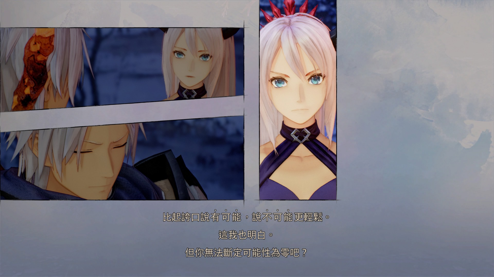

三年前我写下「[想象便是在构筑现实](/blog/a-chuni-manifesto/)」，颇有些「虽陷果壳之中，仍自以为无限宇宙之王」的感觉。然而，GN’R 那句「[运用你的幻想](https://en.wikipedia.org/wiki/Use_Your_Illusion)」让我开始重新思考想象的意义——这是他们早在廿世纪九十年代借其双专辑便阐明了的反抗的根本。

Use Your Illusion。这句话本身便暗示了幻想是有力量的，并且需要被得到使用。那么如何运用幻想？又如何「恰当」「正确」地运用幻想？我无权指摘任何人的生活方式，在此不妨提供我近日在游玩游戏《破晓传说》的例子，以飨读者。其中的小剧场有这么一幕：

这就是运用幻想的例子之一。

或许这看起来就像是「转变看待问题的角度」「选择自己相信的事物」——然而这已是弥足珍贵了。想象或是说幻想从来都不能解决所有的问题，但我想在「[元牧场](https://www.solidot.org/story?sid=68801)」时代，每一位数字原住民都需要学会运用它的幻想。