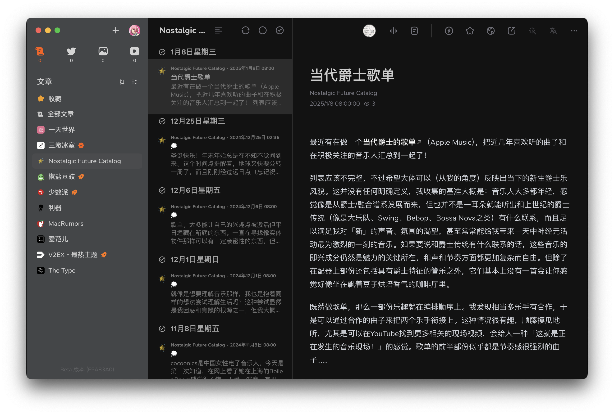
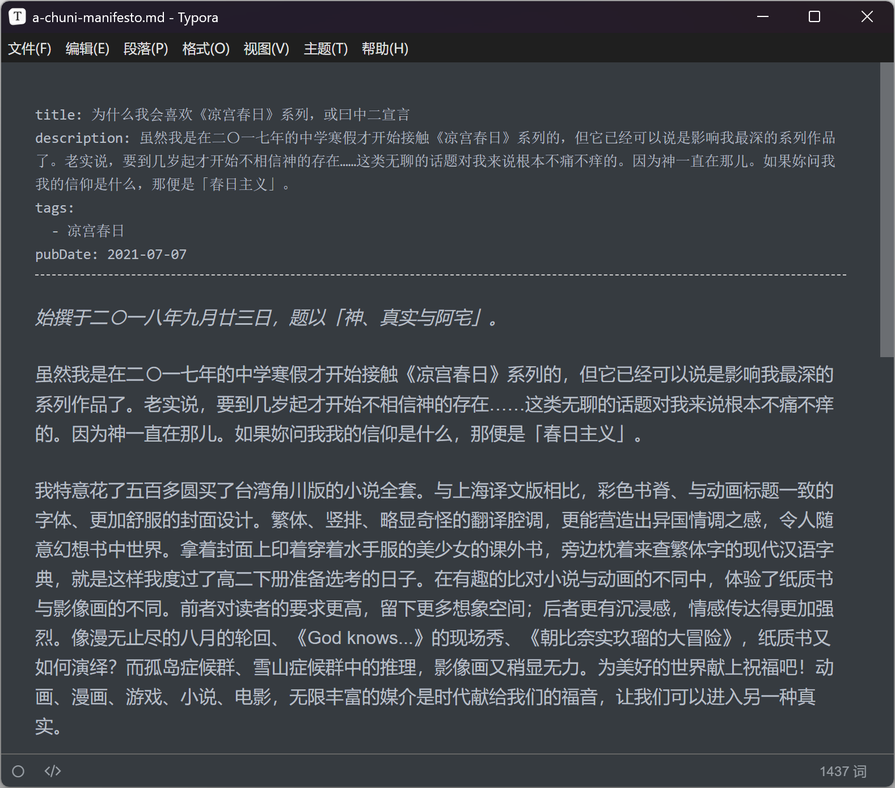
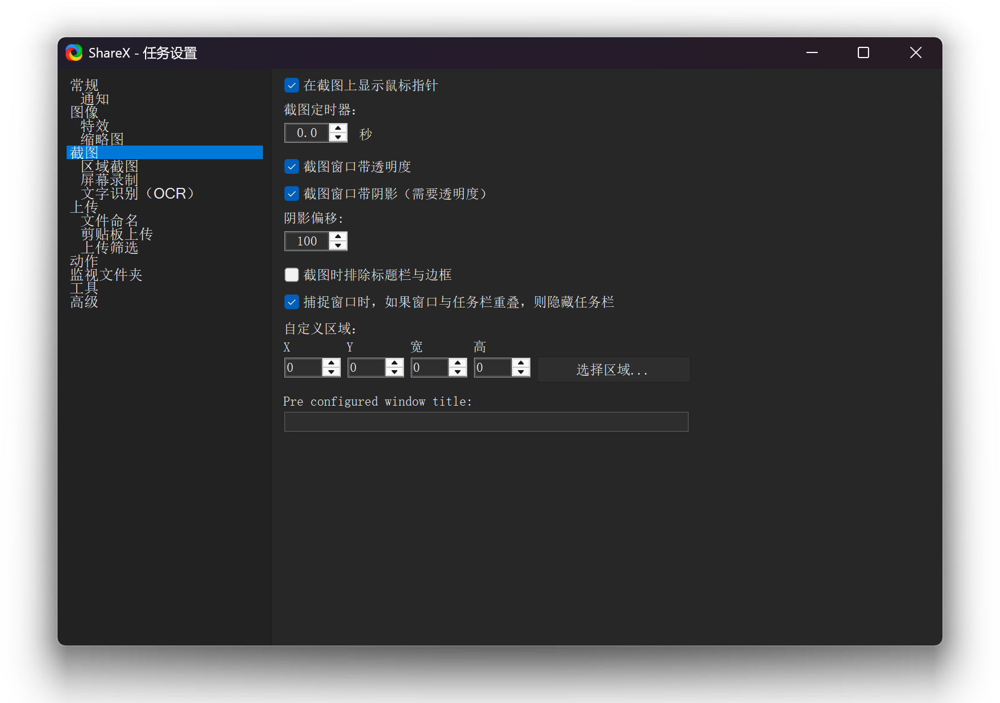

在 macOS 上，妳可以使用 `⇧ + ⌘ + 5` 快捷键唤起系统自带的「截屏」应用，来截图、录屏。*详见[在 Mac 上截屏或录屏](https://support.apple.com/zh-cn/guide/mac-help/mh26782/mac)。*

自 Windows 10 起，妳也可以使用 `Win + Shift + S` 快捷键来唤起系统自带的「截图工具」应用，来实现与 macOS 类似的截图体验。

然而相似的只是截图体验，并非截图效果。「截图工具」捕获的窗口图片：

- 没有窗口周围的阴影
- 包含了窗口背后的图像

若妳在 Google 搜索「Mac-like screenshot tool on Windows」，妳会得到「使用 `Win + Shift + S`」的回答。Windows 用户似乎没有截取美观的图片的需求。

除却「截图工具」外，我还尝试过不少热门的 Windows 截图工具，像是 Snipaste、PixPin 和 Greenshot 等，但它们无一能实现上述的「Mac-like」截图效果。

LINUX DO 的一个[帖子](https://linux.do/t/topic/330335/5)推荐了「ShareX」，其截取活动窗口的功能在设置「截图窗口带阴影」后，截图图片便能达到类似 macOS 的截图效果：

ShareX 还支持功能强大的图像特效，官方提供了不少[例子](https://getsharex.com/image-effects)供参考。_如果妳遇到粘贴剪贴板的图片背景不为透明的情况，可以参考[这个](https://github.com/ShareX/ShareX/issues/6607) GitHub Issue。_

实际上，PixPin 也支持给截图区域周围添加阴影的功能，但其截图图片仍包含窗口背后的图像。

既然 ShareX 能够做到不包含窗口背后的图像地截图，说明并非 Windows 不支持该功能，只是其他诸多截图工具*（包括 Windows 自带的「截图工具」）*并没有默认集成。Who cares?

另外，OBS Studio 中的「捕获窗口」功能也能实现类似的效果。但我并没有在 OBS Studio 找到把捕获的窗口导出为图片的功能，更何况将一个串流软件作为截图工具有些显得杀鸡用牛刀了。
